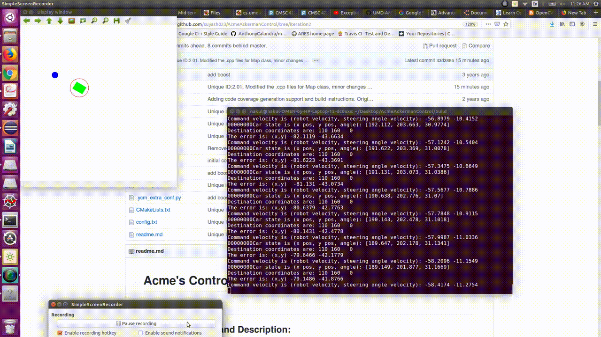

# Acme's Controller for Ackermann Kinematic Model

[](https://travis-ci.org/suyash023/AcmeAckermanControl)
[](https://coveralls.io/github/suyash023/AcmeAckermanControl?branch=iteration2)
---
## Acme Ackerman Kinematic Model Demo  


## Project Overview and Description:

This repository contains the implementation of the Ackermann Module, with the visualization, and three modules: Map, AckermanKinematicModel and Pid.  The user provides start and target coordinates. Visualization is created demonstrating convergence to the set point.   

The controller for Ackermann kinematic model consists of three submodules : 

#### 1) Map module
 The map module consists of a 2D visualisation in which the map and robot are represented as images, with robot as a smaller image. It has following features:
- Sets start and destination coordinates based on user inputs and their validity.
- Provides current coordinates of the robot to Pid controller class module.
- Initializes the map for visualization of movement of robot.
- Updates the location of the robot based on the input from AckermanKinematicModel class module.

#### 2) Pid controller module
The PID controller takes current and target state(x, y, theta) from the Map class and gives steering angle and car(robot) velocity as output.It's featurs are as follows:
- Stores Kp,Ki and Kd gain values. 
- Stores sum of errors as well as last error.
- Computes control signal (Robot velocity, steering angle) based on error calculated using current coordinates and destination coordinates of the robot.

#### 3) AckermanKinematicModel module
The AckermanKinemticModel takes the car velocity and steering angle as input from the PID class, and updates the state by calculating the variation in them and adding it to each state, which in turn is given as input to Map class, to update the robot image. It has following features:
- Stores the values of robot's wheelbase and axlewidth and checks their validity.
- Checks the validity of robot velocity and steering angle received as an input from Pid controller class module.
- Checks angle constraints on inner and outer wheel angles.
- Updates the car's current coordinates based on the robot velocity and steering angle received as an input from Pid controller class module.

## Group Members

Ishan Patel
Nakul Patel
Suyash Yeotikar

## Libraries Required
- OpenCV
- Boost
- Eigen

## Standard install via command-line:
```
git clone --recursive https://github.com/suyash023/AcmeAckermanControl.git
cd <path to repository>
mkdir build
cd build
cmake ..
make
Run tests: ./test/cpp-test
Run program: ./app/shell-app ../config.txt
```
## Parameters of config file
Following are the sequence of the user inputs entered in the config file:
1) Robot wheelbase 
2) Robot axlewidth
3) Map bounds
4) Start coordinates
5) Destination coordinates
6) Kp gains for velocity and steering angle
7) Ki gains for velocity and steering angle
8) Kd gains for velocity and steering angle

## Google Sheet for AIP: 

https://docs.google.com/spreadsheets/d/1cCmYP9rGVsWmyAf39ayQJ9aq3QtM9_lUnefQbatCKaI/edit?usp=sharing


## Sprint Planning Notes:

https://docs.google.com/document/d/1JT7k-D8IgDNpvIvN3qUCVz5M1oPum1FsyDsK1AOXwtk/edit?usp=sharing


## Agile Iteration Process for this project:

## Iteration 1:
Repository setup, Travis and Coveralls setup, License selection,
class design, UML diagrams and writing class stubs.

Map: Suyash(Driver), Nakul(Navigator) and Ishan(Design Keeper)

AckermanKinematicModel: Nakul(Driver), Ishan(Navigator) and Suyash(Design Keeper)

Pid: Ishan(Driver), Suyash(Navigator) and Nakul(Design Keeper)

## Iteration 2:
Unit tests for each module, Implementation of all the modules, Fixed the bugs/methods to pass Unit tests, Run cpplint and cppcheck and fixed errors, Generated doxygen documentation, Update readme with proper details and descriptions   

Map: Nakul(Driver), Ishan(Navigator) and Suyash(Design Keeper)

AckermanKinematicModel: Ishan(Driver), Suyash(Navigator) and Nakul(Design Keeper)


Pid: Suyash(Driver), Nakul(Navigator) and Ishan(Design Keeper)


## Doxygen Documentation

Although the repository contains the documentation, if you'd still like to generate it then follow the instructions below.

Install doxygen using below commands
```
sudo apt-get install doxygen
sudo apt-get install doxygen-gui
```
After installation run following command to open the doxywizard wherein you can fill in the details as required and set the source code folder to the repository as well. Create a new folder in the repository and select that as the destination directory. Add paths to include and src folders and then proceed with the default settings and generate the documentation.
```
doxywizard
```


## Building for code coverage:
```
sudo apt-get install lcov
cmake -D COVERAGE=ON -D CMAKE_BUILD_TYPE=Debug ../
make
make code_coverage
```
This generates a index.html page in the build/coverage sub-directory that can be viewed locally in a web browser.

## Working with Eclipse IDE ##
## Installation

In your Eclipse workspace directory (or create a new one), checkout the repo (and submodules)
```
mkdir -p ~/workspace
cd ~/workspace
git clone --recursive https://github.com/suyash023/AcmeAckermanControl.git
```
In your work directory, use cmake to create an Eclipse project for an [out-of-source build] of cpp-boilerplate

```
cd ~/workspace
mkdir -p Acme-eclipse
cd Acme-eclipse
cmake -G "Eclipse CDT4 - Unix Makefiles" -D CMAKE_BUILD_TYPE=Debug -D CMAKE_ECLIPSE_VERSION=4.7.0 -D CMAKE_CXX_COMPILER_ARG1=-std=c++14 ../AcmeAckermanControl/
```


